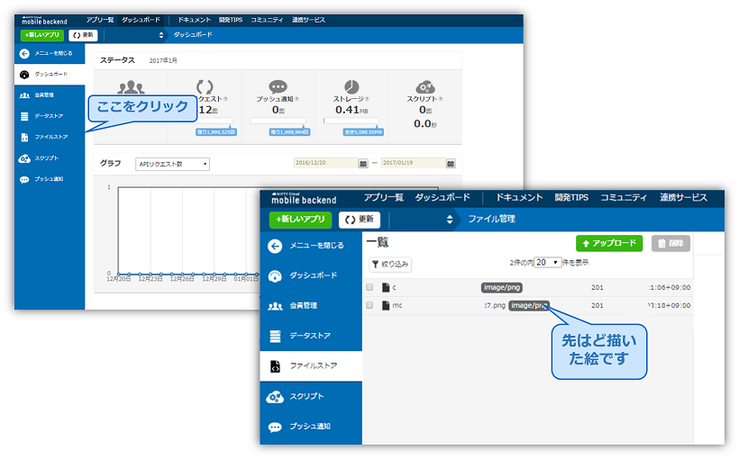

# 【Unity】描いた絵をクラウドで共有しましょ！
### 簡単な絵を描く、クラウドに保存・取得するのアプリ「Blackboard」


## 概要
* [ニフティクラウドmobile backend](http://mb.cloud.nifty.com/)の『ファイルストア機能』を利用してUnityのサンプルプゲームプロジェクトです
* 簡単な操作ですぐに [ニフティクラウドmobile backend](http://mb.cloud.nifty.com/)の機能を体験いただけます★☆

## ニフティクラウドmobile backendって何？？
スマートフォンアプリのバックエンド機能（プッシュ通知・データストア・会員管理・ファイルストア・SNS連携・位置情報検索・スクリプト）が**開発不要**、しかも基本**無料**(注1)で使えるクラウドサービス！今回はデータストアを体験します

注1：詳しくは[こちら](http://mb.cloud.nifty.com/price.htm)をご覧ください


## 動作環境
* windows7以上、或いはOS X
* Unity5.3.5以上

※上記内容で動作確認をしています。


## 手順
###『STEP 1』アカウントせ作成 ⇒ アプリ起動
### 1. [ニフティクラウドmobile backend](http://mb.cloud.nifty.com/)の会員登録とログイン→アプリ作成

* 上記リンクから会員登録（無料）をします。登録ができたらログインをすると下図のように「アプリの新規作成」画面が出るのでアプリを作成します


* アプリ作成されると下図のような画面になります
* この２種類のAPIキー（アプリケーションキーとクライアントキー）はXcodeで作成するiOSアプリに[ニフティクラウドmobile backend](http://mb.cloud.nifty.com/)を紐付けるために使用します


### 2. [GitHub](https://github.com/hounenhounen/UnityLoginApp)からサンプルプロジェクトの<a href="https://github.com/ellentby/Blackboard/archive/master.zip">ダウンロード</a>

### 3. Unityでアプリを起動

* ダウンロードしたフォルダを解凍し、Unityから開いてください。その後、blackboardシーンを開いてください。


### 4. APIキーの設定

* blackboardシーンの`NCMBSettings`を編集します
* 先程[ニフティクラウドmobile backend](http://mb.cloud.nifty.com/)のダッシュボード上で確認したAPIキーを貼り付けます


* それぞれ`YOUR_NCMB_APPLICATION_KEY`と`YOUR_NCMB_CLIENT_KEY`の部分を書き換えます
 * このとき、ダブルクォーテーション（`"`）を消さないように注意してください！
* 書き換え終わったら、シーンを保存して下さい。

### 5. アプリ再生
* Unity画面で上部真ん中の実行ボタン（さんかくの再生マーク）をクリックしして、次の画面が出たら、成功になります！


<br/>
###『STEP 2』アプリ操作　＆　動作確認
* ブラックボードに適当な絵をか描いて下さい。そして、「Save」ボタンをクリックして下さい。

* セーブが完了したら、ブラックボードは初期化にされます。そして、「Gallery」をクリックすると、先ほどか描いた絵を確認できます。


---------
* ダッシュボードで動作確認しましょう！
  1. ニフティクラウドmobile backendの<a href="https://console.mb.cloud.nifty.com">ダッシュボード</a>で、左の「ファイルストア」をクリックして下さい。
  2. 先ほど描いた絵のファイルを確認しましょう。


##機能解説
### SDKのインポートと初期設定
* ニフティクラウドmobile backend の[ドキュメント（クイックスタート）](http://mb.cloud.nifty.com/doc/current/introduction/quickstart_unity.html)をUnity版に書き換えたドキュメントをご用意していますので、ご活用ください。

### コード解説
プロジェクトのコードファイルは以下の五つになります。これから、`「SaveImage.cs」`と`「LoadImage.cs」`について解説します。
`````````
`````Asset/script
``````````ButtonController.cs     ボタンのclickeventの処理
``````````DrawLine.cs             絵を描く機能の処理
``````````ScreenAdapter.cs        シーン「gallery」に展示する四枚の画像の位置・サイズ調整
``````````SaveImage.cs            描いた絵をスクリーンショットで取得し、クラウドに保存する
``````````LoadImage.cs            クラウドで保存された最新の四枚の画像を取得し、展示する
`````````
###「SaveImage.cs」
####画像を取得し、クラウドに保存
* <a href="https://docs.unity3d.com/ScriptReference/Texture2D.ReadPixels.html">Texture2D.ReadPixels()</a>関数に通して、変量「camera」（シーンのMainCamera）が撮った画面をbyte[]タイプのスクリーンショートで取得します。
``````cs
public Camera camera;
RenderTexture renderTexture;

public void saveImage () {
		float width = Screen.width;
		float height = Screen.height;
	
		renderTexture = new RenderTexture (Screen.width, Screen.height, 0);
		camera.targetTexture = renderTexture;
		camera.Render ();

		RenderTexture.active = renderTexture;
		Texture2D virtualPhoto =
			new Texture2D((int)width, (int)height, TextureFormat.RGB24, false);
		// false, meaning no need for mipmaps
		virtualPhoto.ReadPixels( new Rect(0, 0, width, height), 0, 0);

		RenderTexture.active = null; //can help avoid errors 
		camera.targetTexture = null;

		byte[] bytes;
		bytes = virtualPhoto.EncodeToPNG();
		saveToCloud (bytes,getName());
	}
``````

* 取得した画像データをmBaas（ニフティクラウドmobile backend）のSDKでクラウドに保存します。
``````cs
	void saveToCloud(byte[] bytes, string name){
		NCMBFile file = new NCMBFile (name, bytes);
		file.SaveAsync ((NCMBException error) => {
			if (error != null) {
				// 失敗
				Debug.Log("upload image error");
			} else {
				//成功
				Debug.Log("upload image success");
				Application.LoadLevel("blackboard");
			}
		});
	}
``````

###「LoadImage.cs」
####クラウドから画像を取得し、スクリーンで展示

*　シーン「gallery」に四つのImage Gameobjectを用意します。これからクラウドから取得する画像は、この四つのGameobjectで表示します。


* 以下のコードで、最新画像を1つずつクラウドから取得します。<br/>
  「imageList」の中は、シーンから取得した四つのImage Gameobjectです。
``````cs
	public List<Image> imageList;//シーン「gallery」の四つのImage Gameobject

	// Use this for initialization
	void Start () {
		//シーンが開始した時、1つずつ画像を取得する
		for(int i=0; i<imageList.Count; i++){
			LoadOneImage (i, imageList[i]);
		}
	}

	public void LoadOneImage(int index, Image go){
		NCMBQuery<NCMBFile> query = NCMBFile.GetQuery ();
		//検索条件を設定する
		query.Skip = index;
		query.Limit = 1;
		query.OrderByDescending ("createDate");
		query.FindAsync ((List<NCMBFile> objList, NCMBException error) => {
			if (error != null) {
				// 検索失敗
			} else {
				// 検索成功
				foreach (NCMBFile file in objList) {
					file.FetchAsync ((byte[] fileData, NCMBException e) => {
						if (e != null) {
							// 取得失敗
						} else {
							// 取得成功
							SaveBytes(fileData, go);
						}
					});
				}
			}
		});
	}
``````

*　取得した画像を、Image Gameobjectで表示します。

`````cs
	void SaveBytes(byte[] b, Image go){
		Texture2D texture = new Texture2D (100,100);
		texture.LoadImage (b);
		Sprite sprite = Sprite.Create(texture, new Rect(0, 0, texture.width, texture.height), Vector2.zero);
		go.sprite = sprite;
		Resources.UnloadUnusedAssets(); 
	}
`````

## 参考
* ニフティクラウドmobile backend の[ドキュメント（ファイルストア）](http://mb.cloud.nifty.com/doc/current/filestore/basic_usage_unity.html)
* このアプリを基にしての落書きゲーム[「Doodle」](https://github.com/ellentby/Doodle-DrawTogether)
